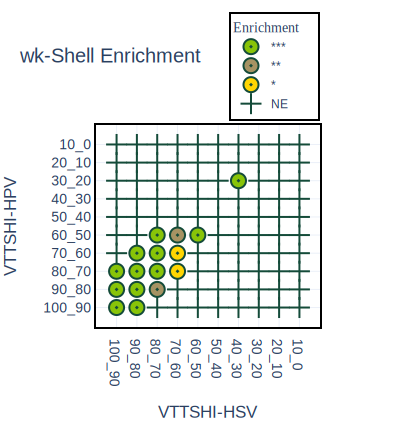

# A pipeline of integrating transcriptome and interactome to elucidate central nodes in host-pathogens interactions

Kumar N, Mishra B, Mukhtar MS. A pipeline of integrating transcriptome and interactome to elucidate central nodes in host-pathogens interactions. STAR protocols. 2022 Sep 16;3(3):101608.

## Summary

### The pathophysiology of this virus is complex and difficult to investigate in humans. To study the human viral interactome, we took an integrated network-biology-transcriptome approach. Using data from five sources, we constructed a comprehensive human interactome based on high-quality interaction protein-protein interactions. A viral-targets-transcriptomes-specific human interactome (VTTSHI) was then produced based on the viral protein targets and transcriptome data of HPV and HSV respectively. To identify nodes pivotal to viral pathogenicity, we used topological clustering and pathway enrichment analysis.



For complete details on the use and execution of this protocol, please refer to Kumar et al. 
[Integrative Network Biology Framework Elucidates Molecular Mechanisms of SARS-CoV-2 Pathogenesis] Kumar N, Mishra B, Mehmood A. Integrative network biology framework elucidates molecular mechanisms of SARS-CoV-2 pathogenesis. iScience 23 (9): 101526.


### Cloning VTTSHI
To clone this project please enter below command in you terminal:
```bash
git clone https://github.com/nilesh-iiita/VTTSHI
``` 

### Enviroment setup
To run this project you need to fullfill specific packages. Please run the following command in your terminal:
```bash
module load Anaconda3/2020.07
conda env create --file VTTSHI.yml
```
_**NOTE:**_ This instructions only works if you are using [Cheaha Supercomputer](https://www.uab.edu/it/home/research-computing/cheaha).

[A pipeline of integrating transcriptome and interactome to elucidate central nodes in host-pathogens interactions](A pipeline of integrating transcriptome and interactome to elucidate central nodes in host-pathogens interactions)
